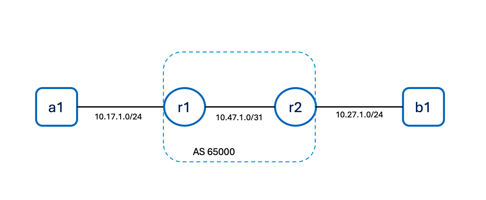

# c8000v 2 node 

The primary purpose of this scenario is to test the c8000v image within a Containerlab system. 

Topology connects to linux containers, a1 and a2, over a layer 3 vpn running across two direclty connected routers - r1 and r2.  

Diagram: 

